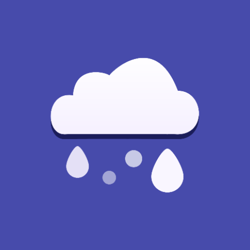

Aqui está a tradução para inglês:

---

# Nuage

Nuage is a weather application developed in Android Studio using Jetpack Compose and the Kotlin programming language.

## Features

* View weekly weather forecast
* View daily weather forecast
* Search by location
* Toggle between light mode and dark mode
* Available in the following languages:

  * Portuguese (Portugal)
  * English

## Attributions

* Weather data provided by [Open-Meteo.com](https://open-meteo.com/)
* Icons provided by [Pictogrammers](https://pictogrammers.com/)
* Background images provided by [Pexels](https://www.pexels.com/)
