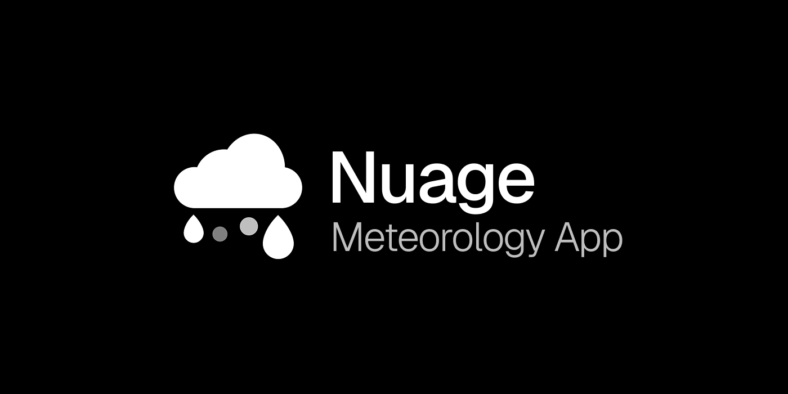

 
 

# Nuage

Nuage is a weather app developed by me in collaboration with my friend ReduxFlakes. The app will serve as my course's final project, summarizing everything I've learned.

## Table of Contents

- [1. Main Idea](#1-MainIdea)
- [2. Features](#2-Features)
- [3. Installation](#3-Installation)
- [4. Requirements](#4-Requirements)
- [5. Road Map](#5-Roadmap)
- [6. License](#6-License)

## Main Idea

The original goals of Nuage were developing a simple yet functional and visual-pleasing meteorology app for android devices. I tried matching the design with the Swiss design methodology, despite having no big similarities. The app also began development in hopes of showing my knowledge in programming and design, being mainly a self-taught journey alongside my dear friend [@ReduxFlakes](https://github.com/ReduxFlakes).

## Features

- Different data for a specific location;
- Specific tracking for each day;
- Search function, that mantains the specific location even after leaving the App;

## Installation 

The App is currently still under final developments. An APK link will be added in a near future. Stay tuned to this repository.

## Requirements

- Android 12.0 (SDK 31 or higher);
- Minimum disk space of 80mb (the app will go under a big optimization in the future);
- That's pretty much it :D

## Roadmap

Nuage despite being used as my final project should and will be a project that will carry on into the future. Therefore, this are some of the features planned for Nuage:

- Use of IPMA's API (Instituto Português do Mar e da Atmosfera);
- Settings section;
- Multiple languages in the future;
- Variable theme, according to user's preference.

## License

Nuage is licensed under [Apache 2.0](https://www.apache.org/licenses/LICENSE-2.0)

